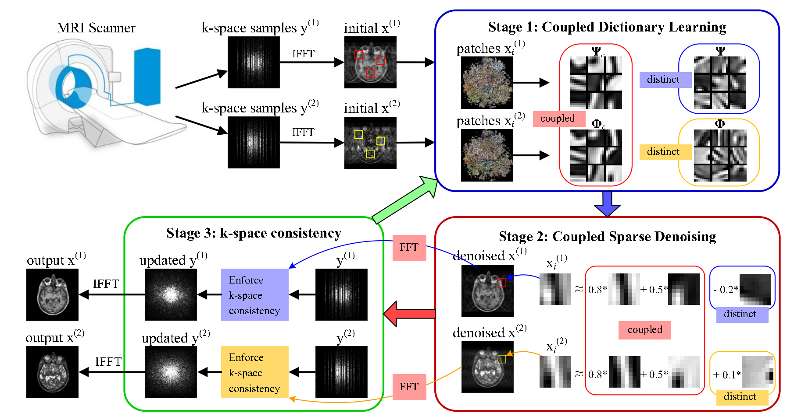
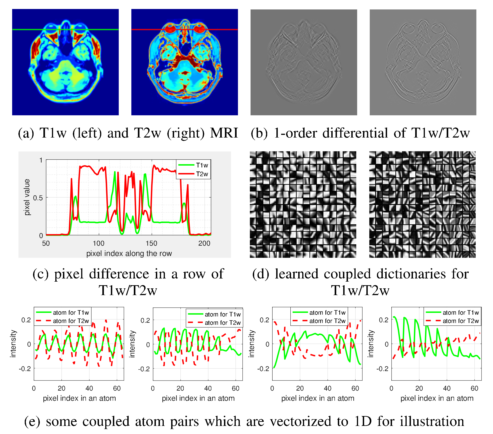
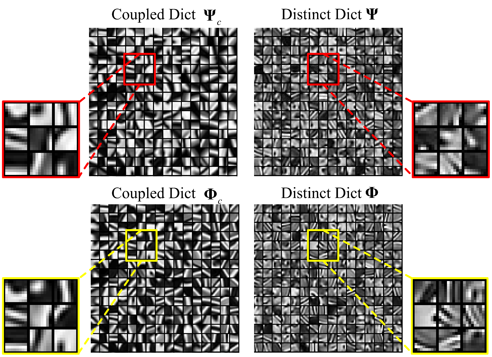
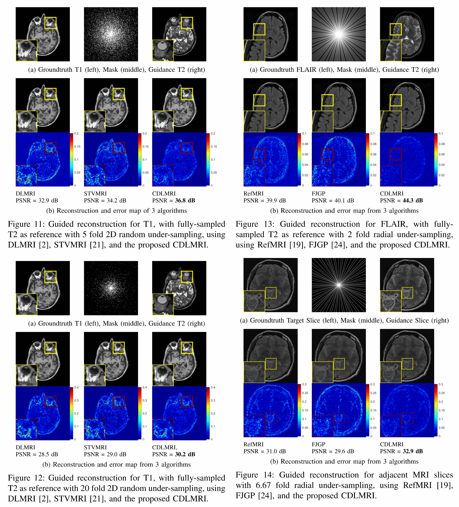

# Coupled Dictionary Learning for Multi-contrast MRI Reconstruction

This software is to perform Coupled Dictionary Learning based Multi-contrast MRI Reconstruction for two cases: 
* case 1 - Guided reconstruction: reconstructs target contrast, e.g. T1-weighted from its under-sampled k-space measurements with another fully-sampled contrast, e.g. T2-weighted as reference/guidance. 
* case 2 - Joint reconstruction: jointly reconstructs two contrasts, e.g. T1-weighted and T2-weighted contrasts from their under-sampled k-space measurements.

References：
----------------------------
[1] P. Song, L. Weizman, J. F. C. Mota, Y. C. Eldar and M. R. D. Rodrigues, "Coupled Dictionary Learning for Multi-Contrast MRI Reconstruction," in IEEE Transactions on Medical Imaging, vol. 39, no. 3, pp. 621-633, March 2020, doi: 10.1109/TMI.2019.2932961.
[2] P. Song, L. Weizman, J. F. C. Mota, Y. C. Eldar and M. R. D. Rodrigues, "Coupled Dictionary Learning for Multi-Contrast MRI Reconstruction," IEEE International Conference on Image Processing (ICIP), 2018, pp. 2880-2884, doi: 10.1109/ICIP.2018.8451341.

Folders and Usage:
----------------------------
The 3 folders named as "Code_Cartesian", "Code_Radial", "Code_Random" correspond to 3 different sampling patterns. In each fold, the .m file with name "Main_CDLMRI\_\*\_Guided.m" denotes the guided reconstruction form, while the .m file with name "Main_CDLMRI\_\*\_Guided.m" denotes the joint reconstruction form.

Guided reconstruction:
>> "Main_CDLMRI\_\*\_Guided.m"  % demo performing Coupled Dictionary Learning for Multi-contrast MRI Reconstruction that reconstructs target contrast, e.g. T1-weighted, from its under-sampled k-space measurements with another fully-sampled different contrast, e.g. T2-weighted as reference/guidance.  

Joint reconstruction::
>> "Main_CDLMRI\_\*\_Guided.m" % demo performing Coupled Dictionary Learning for Multi-contrast MRI Reconstruction that jointly reconstructs two contrast, e.g. T1-weighted and T2-weighted contrasts from their under-sampled k-space measurements.

If you want to use new images, please replace the images in folder "TestImages_MRI" by yours.

Subfolders:
----------------------------
Each folder may contain following subfolders:

- TestImages_MRI

  Testing MRI contrasts.

- SamplingMasks/CartesianMasks

  Gaussian 2D sampling patterns / Cartesian 1D sampling patterns. Note, the radial sampling pattern is generated using NUFFT package by J. A. Fessler, et al. To using radial sampling, please download and install the NUFFT package and then change the directory in the corresponding .m files. Please refer to (J. A. Fessler and B. P. Sutton, “Nonuniform fast fourier transforms using min-max interpolation,” *IEEE Trans. Sig. Proc.*, vol. 51, no. 2, pp. 560– 574, 2003. ) for details.

- Dicts

  Contains pre-trained coupled dictionaries using BrainWeb MRI contrasts, which are different from the testing MRI contrasts.  These pre-trained dictionaries only serve as initialization for coupled dictionary learning. Other alternative initialization methods also work well, such as PCA, randomly selected patches.

Parameters Setting:
----------------------------
Note that all input parameters need to be set prior to simulation. We provide some example settings for the input parameters below. However, the user is advised to choose optimal values for the parameters depending on the specific data or task at hand.

**Key parameter setting:**
+ DLMRIparams.th = errthArray; % denotes a set of error thresholds for sparse coding. Adjust the ErrTh_start, ErrTh_end and numIter to construct a set of linearly decreasing error thresholds errthArray throughout the outer iterations. ErrTh_start, ErrTh_end depends on the estimated initial PSNR and final PSNR. Typical values are ErrTh_start=0.1, ErrTh_end=0.01, and numIter = 40.

Packages and codes included:
----------------------------
Some of the codes are taken from the following articles and packages:

* [3] S. Ravishankar, and Y. Bresler. "MR image reconstruction from highly undersampled k-space data by dictionary learning." IEEE transactions on medical imaging 30, no. 5 (2010): 1028-1041.
* [4] J. Mairal, F. Bach, J. Ponce and G. Sapiro, "Online Dictionary Learning for Sparse Coding", ICML 2009. Package SPAMSv2.5 by Julien Mairal.
* [5] R. Rubinstein, "KSVDBox - Implementation of the K-SVD and K-SVD denoise algorithms." Package OMPBox v9+ and KSVDBox v12+ by Ron Rubinstein
* [6] J. A. Fessler and B. P. Sutton, “Nonuniform fast fourier transforms using min-max interpolation,” *IEEE Trans. Sig. Proc.*, vol. 51, no. 2, pp. 560– 574, 2003. NUFFT package by Jeffrey A. Fessler. https://web.eecs.umich.edu/~fessler/

Codes written & compiled by:
----------------------------
Pingfan Song
Electronic and Electrical Engineering,
Imperial College London
p.song@imperial.ac.uk

Some introduction and results:
----------------------------

Figure 1: Coupled Dictionary Learning for multi-contrast MRI reconstruction framework. It reconstructs the contrasts **x**(1) and **x**(2) jointly from their *k*-space samples. CDLMRI iterates between three stages – coupled dictionary learning, coupled sparse denoising and *k*-space consistency – to progressively remove aliasing and noise and recover fine details.  

Figure 2: Different contrasts often exhibit complex dependencies, sharing a variety of pixel and structure similarities, as shown in (a) and (c). (b) The gradient maps resulting from 1-order differential show resemblance and thus may be used to capture the correlation, but it is not an effective way. (d-e) When splitting different contrasts into small patches, the complex dependencies are disseminated into a variety of simpler and more concise local patterns that can be effectively captured by learned coupled dictionaries. 

Figure 3: Learned coupled dictionaries from T1- and T2-weighted MRI contrasts; 256 atoms are shown. The top row displays the coupled and distinct dictionaries for the T1-weighted contrast. The bottom row displays dictionaries learned from corresponding T2- weighted contrast. It can be seen that the atom pairs from coupled dictionaries Psi_c and Phi_c capture associated edges, blobs and textures with the same direction and location, while distinct dictionaries Psi and Phi represent the disparities.

